# 2.6. Đặc tả và Biểu đồ Use Case, Trình tự, Hoạt động chi tiết từng Phân hệ

Dưới đây là sơ đồ Use Case chi tiết, bảng đặc tả, biểu đồ trình tự (Sequence Diagram), và biểu đồ hoạt động (Activity Diagram) cho từng chức năng của hệ thống **Gigglegram**, được xây dựng đúng theo kiến trúc Microservices và Next.js Frontend.

---

## I. Phân hệ 1: Xác thực & Quản lý tài khoản (Authentication & Profile)

### 1. Sơ đồ Use Case phân hệ

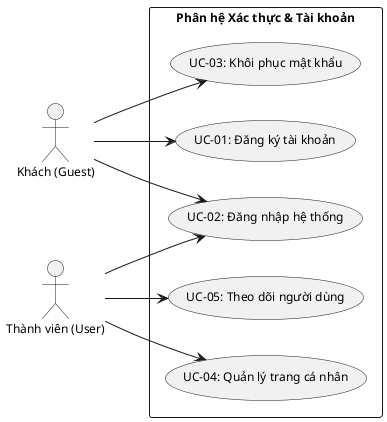

#### Mô tả tóm tắt các Use Case trong Phân hệ 1:

| Mã Use Case | Tên Use Case          | Tác nhân (Actor)         | Mô tả tóm tắt chức năng                                           |
| :---------- | :-------------------- | :----------------------- | :---------------------------------------------------------------- |
| **UC-01**   | Đăng ký tài khoản     | Khách (Guest)            | Người dùng mới đăng ký tài khoản qua Email, Username và Mật khẩu. |
| **UC-02**   | Đăng nhập hệ thống    | Khách, Thành viên, Admin | Xác thực tài khoản của người dùng để truy cập vào hệ thống.       |
| **UC-03**   | Khôi phục mật khẩu    | Khách (Guest)            | Hỗ trợ người dùng khôi phục mật khẩu mới khi quên mật khẩu cũ.    |
| **UC-04**   | Quản lý trang cá nhân | Thành viên (User)        | Chỉnh sửa tên hiển thị, bio, ảnh đại diện và lưu lên hệ thống.    |
| **UC-05**   | Theo dõi người dùng   | Thành viên (User)        | Bắt đầu theo dõi hoặc hủy theo dõi hoạt động của thành viên khác. |

### 2. Mô tả đặc tả và các biểu đồ chi tiết chức năng

#### UC-01: Đăng ký tài khoản

- **Tác nhân chính (Actor):** Khách (Guest)
- **Mục tiêu:** Tạo tài khoản mới để tham gia mạng xã hội.
- **Tiền điều kiện:** Người dùng chưa đăng nhập hệ thống.
- **Hậu điều kiện:** Tài khoản mới được khởi tạo ở trạng thái hoạt động trong cơ sở dữ liệu PostgreSQL.
- **Luồng sự kiện chính:**
  1. Khách nhấn chọn nút "Đăng ký" trên màn hình chào mừng.
  2. Hệ thống hiển thị biểu mẫu yêu cầu nhập: Email, Tên người dùng (Username) và Mật khẩu.
  3. Khách nhập đầy đủ thông tin hợp lệ và nhấn "Đăng ký".
  4. Hệ thống kiểm tra định dạng email, độ mạnh mật khẩu và đảm bảo tên người dùng chưa bị trùng lặp trong cơ sở dữ liệu.
  5. Hệ thống mã hóa mật khẩu, lưu thông tin tài khoản và hiển thị thông báo đăng ký thành công.

##### A. Biểu đồ trình tự (Sequence Diagram - UC-01)

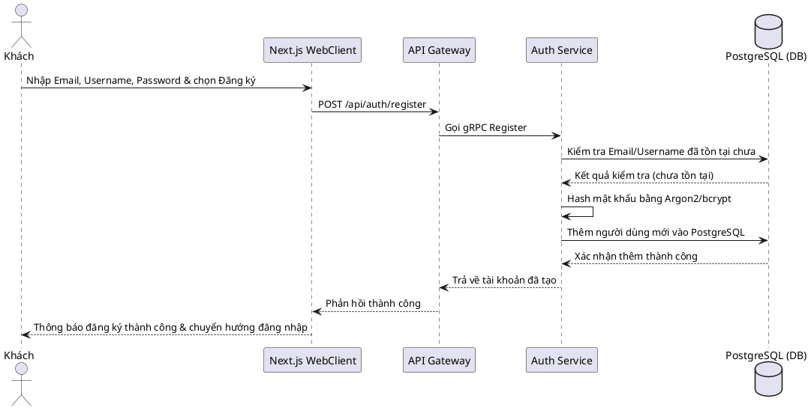

##### B. Biểu đồ hoạt động (Activity Diagram - UC-01)

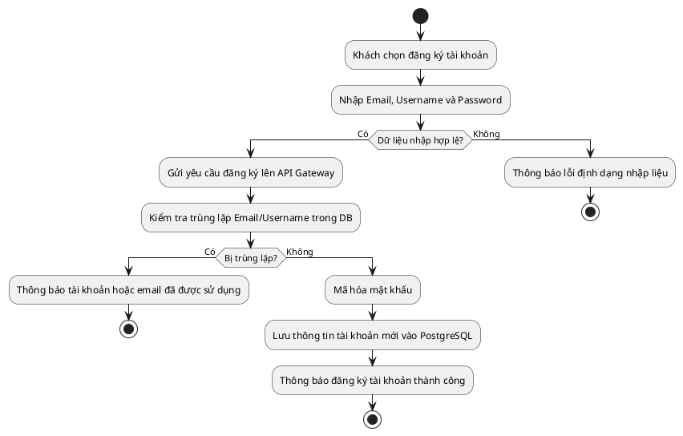

---

#### UC-02: Đăng nhập hệ thống

- **Tác nhân chính (Actor):** Khách (Guest), Thành viên (User), Quản trị viên (Admin)
- **Mục tiêu:** Xác thực danh tính người dùng để mở quyền truy cập hệ thống.
- **Tiền điều kiện:** Người dùng đã có tài khoản được đăng ký hợp lệ.
- **Hậu điều kiện:** Phiên đăng nhập được khởi tạo (Session) lưu trên Redis và Cookie trình duyệt, chuyển hướng người dùng vào bảng tin (Feed) hoặc Dashboard quản trị.
- **Luồng sự kiện chính:**
  1. Người dùng nhấn nút "Đăng nhập".
  2. Hệ thống hiển thị giao diện nhập: Tên đăng nhập/Email và Mật khẩu.
  3. Người dùng nhập thông tin và xác nhận gửi đi.
  4. Hệ thống thông qua thư viện Better-Auth đối chiếu thông tin với cơ sở dữ liệu PostgreSQL.
  5. Nếu thông tin khớp, hệ thống thiết lập Cookie phiên làm việc và chuyển hướng người dùng vào giao diện tương ứng với quyền hạn.

##### A. Biểu đồ trình tự (Sequence Diagram - UC-02)

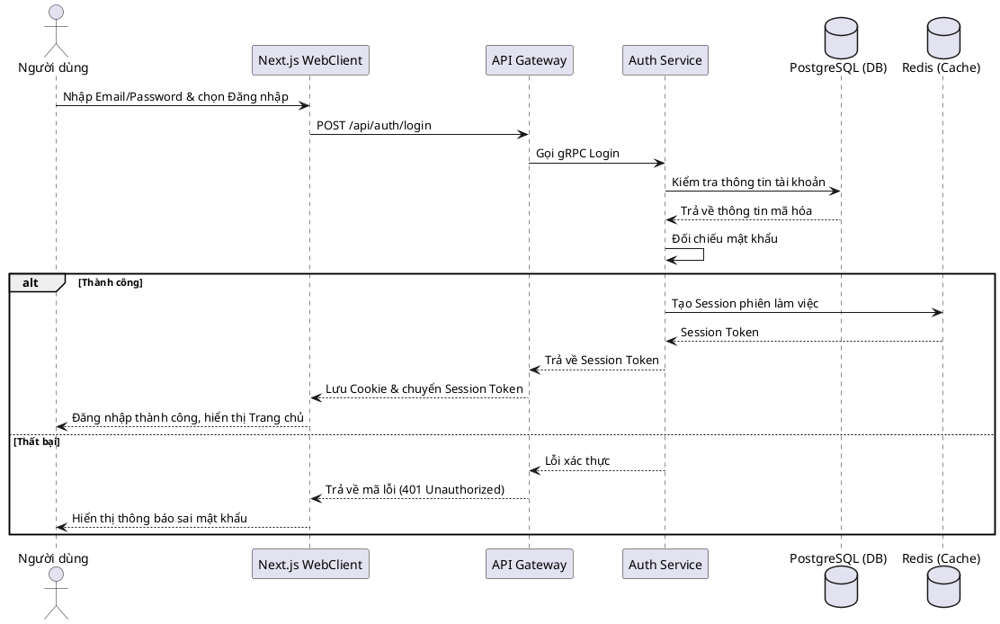

##### B. Biểu đồ hoạt động (Activity Diagram - UC-02)

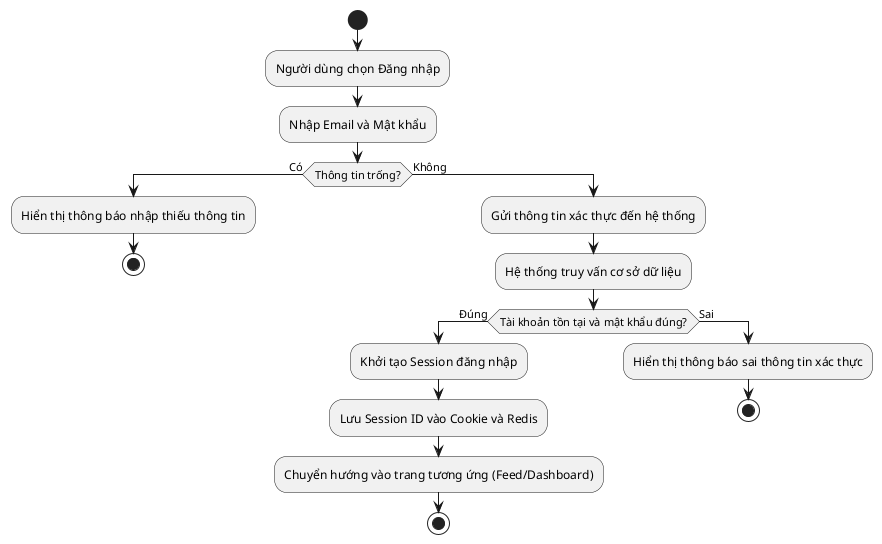

---

#### UC-03: Khôi phục mật khẩu

- **Tác nhân chính (Actor):** Khách (Guest)
- **Mục tiêu:** Cho phép người dùng lấy lại mật khẩu đăng nhập khi quên.
- **Tiền điều kiện:** Tài khoản của khách đã được đăng ký và xác thực từ trước.
- **Hậu điều kiện:** Mật khẩu cũ bị hủy, mật khẩu mới được cập nhật vào PostgreSQL.
- **Luồng sự kiện chính:**
  1. Khách click vào dòng chữ "Quên mật khẩu?" trên trang đăng nhập.
  2. Hệ thống yêu cầu nhập Email đã đăng ký tài khoản.
  3. Khách điền Email và nhấn "Gửi yêu cầu".
  4. Hệ thống sinh mã OTP và gửi vào hòm thư Email của khách.
  5. Khách click link, nhập mật khẩu mới và xác nhận lưu lại.
  6. Hệ thống mã hóa mật khẩu mới và cập nhật vào cơ sở dữ liệu.

##### A. Biểu đồ trình tự (Sequence Diagram - UC-03)

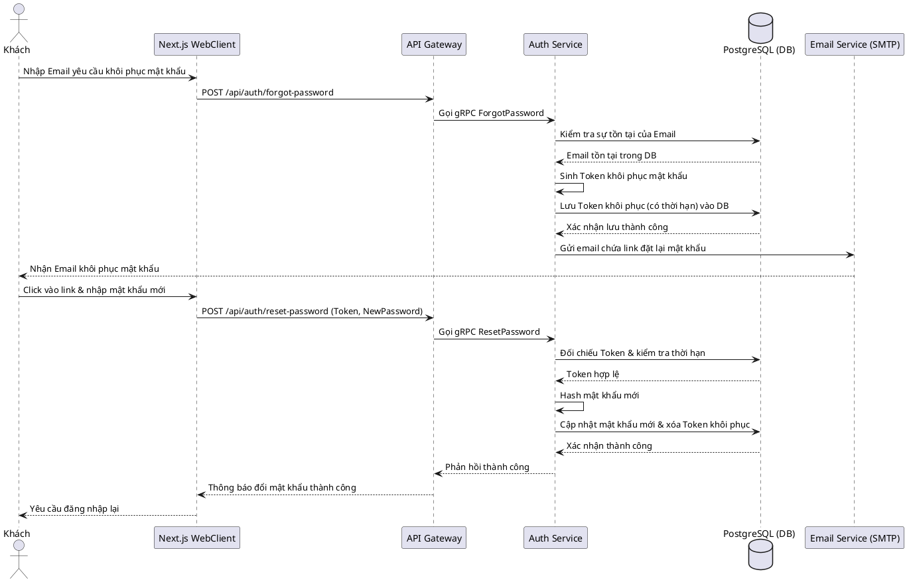

##### B. Biểu đồ hoạt động (Activity Diagram - UC-03)

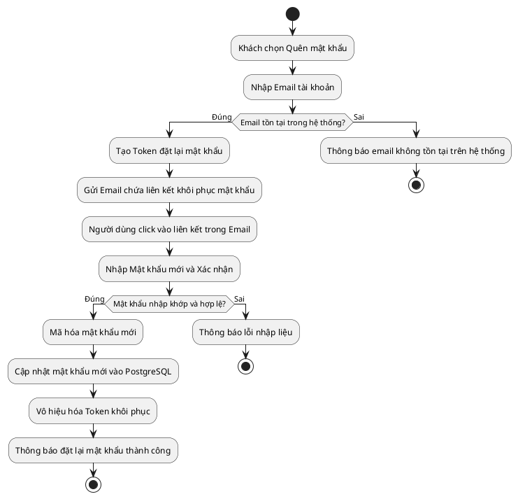

---

#### UC-04: Quản lý trang cá nhân

- **Tác nhân chính (Actor):** Thành viên (User)
- **Mục tiêu:** Cập nhật thông tin cá nhân hiển thị công khai trên mạng xã hội.
- **Tiền điều kiện:** Thành viên đã đăng nhập hệ thống thành công.
- **Hậu điều kiện:** Thông tin cá nhân mới được cập nhật vào cơ sở dữ liệu PostgreSQL và hiển thị trên trang cá nhân.
- **Luồng sự kiện chính:**
  1. Thành viên truy cập vào "Trang cá nhân", chọn "Chỉnh sửa trang cá nhân".
  2. Hệ thống hiển thị form nhập: Ảnh đại diện (Avatar), Tên hiển thị (Display Name), và Tiểu sử (Bio).
  3. Thành viên tải lên ảnh đại diện mới hoặc viết mô tả bio mới và nhấn "Lưu".
  4. Hệ thống tải ảnh đại diện lên Google Cloud Storage (GCS) và cập nhật đường dẫn ảnh cùng dữ liệu bio mới vào PostgreSQL.

##### A. Biểu đồ trình tự (Sequence Diagram - UC-04)

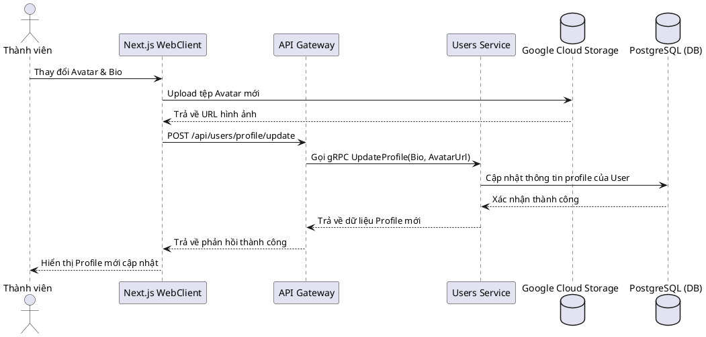

##### B. Biểu đồ hoạt động (Activity Diagram - UC-04)

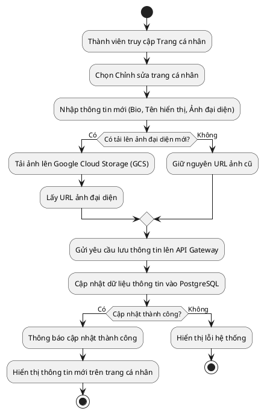

---

#### UC-05: Theo dõi người dùng

- **Tác nhân chính (Actor):** Thành viên (User)
- **Mục tiêu:** Thiết lập mối quan hệ theo dõi để cập nhật hoạt động của người khác.
- **Tiền điều kiện:** Thành viên đã đăng nhập hệ thống.
- **Hậu điều kiện:** Quan hệ theo dõi (Follow/Unfollow) được ghi nhận trong cơ sở dữ liệu, danh sách bài đăng ở Feed cập nhật tương ứng.
- **Luồng sự kiện chính:**
  1. Thành viên mở xem trang cá nhân của một người dùng khác.
  2. Thành viên nhấn nút "Theo dõi" (hoặc "Hủy theo dõi" nếu đã theo dõi từ trước).
  3. Hệ thống tiếp nhận yêu cầu, cập nhật quan hệ vào bảng dữ liệu follow trong PostgreSQL.
  4. Hệ thống sinh sự kiện đẩy vào Kafka để Feed Service xử lý cập nhật lại bảng tin của thành viên và Real-Time Service gửi thông báo cho người dùng được theo dõi.

##### A. Biểu đồ trình tự (Sequence Diagram - UC-05)

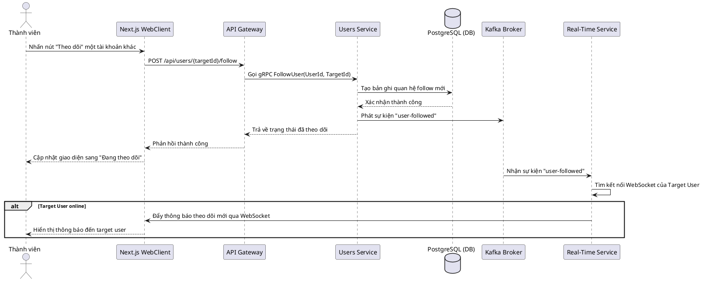

##### B. Biểu đồ hoạt động (Activity Diagram - UC-05)

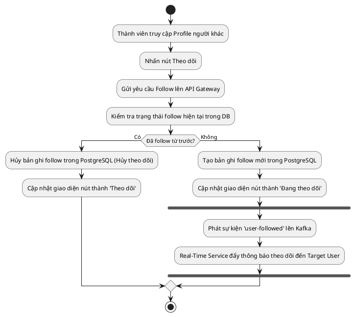

---

## II. Phân hệ 2: Đăng tải & Bảng tin (Post & Feed)

### 1. Sơ đồ Use Case phân hệ

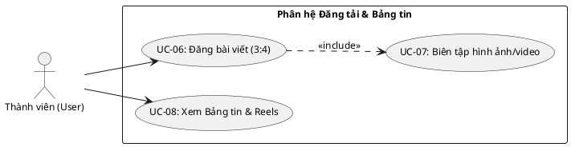

#### Mô tả tóm tắt các Use Case trong Phân hệ 2:

| Mã Use Case | Tên Use Case            | Tác nhân (Actor)  | Mô tả tóm tắt chức năng                                                     |
| :---------- | :---------------------- | :---------------- | :-------------------------------------------------------------------------- |
| **UC-06**   | Đăng bài viết (3:4)     | Thành viên (User) | Tạo bài đăng mới chứa tệp tin ảnh hoặc video theo tỷ lệ 3:4 chuẩn.          |
| **UC-07**   | Biên tập hình ảnh/video | Thành viên (User) | Áp dụng bộ lọc ảnh hoặc chọn khung hình (thumbnail) đại diện cho video.     |
| **UC-08**   | Xem Bảng tin & Reels    | Thành viên (User) | Xem danh sách bài viết từ người mình theo dõi hoặc cuộn xem các video ngắn. |

### 2. Mô tả đặc tả và các biểu đồ chi tiết chức năng

#### UC-06: Đăng bài viết (3:4)

- **Tác nhân chính (Actor):** Thành viên (User)
- **Mục tiêu:** Tạo bài viết mới chứa tệp tin đa phương tiện nhằm chia sẻ với cộng đồng.
- **Tiền điều kiện:** Thành viên đã đăng nhập hệ thống.
- **Hậu điều kiện:** Bài đăng mới được hiển thị công khai, tệp tin lưu trên GCS.
- **Luồng sự kiện chính:**
  1. Thành viên nhấn vào nút tạo bài viết mới "+".
  2. Hệ thống mở cửa sổ yêu cầu chọn tệp ảnh hoặc video từ thiết bị.
  3. Hệ thống bắt buộc người dùng cắt (crop) ảnh/video theo tỉ lệ chuẩn 3:4.
  4. Hệ thống gọi tính năng Biên tập ảnh/video (UC-07) để chỉnh sửa bộ lọc hoặc chọn ảnh bìa.
  5. Thành viên nhập thêm phần mô tả văn bản, gắn vị trí địa lý, các thẻ hashtags và nhấn nút "Đăng".
  6. Hệ thống upload tệp lên GCS, lưu dữ liệu bài đăng vào PostgreSQL và kích hoạt Kafka cập nhật Feed.

##### A. Biểu đồ trình tự (Sequence Diagram - UC-06)

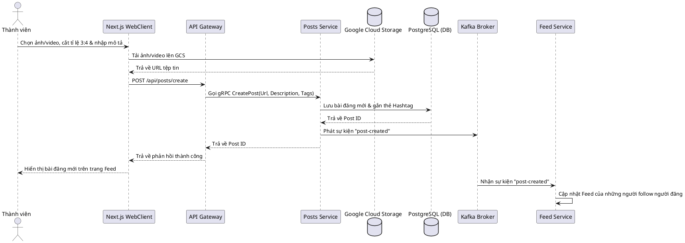

##### B. Biểu đồ hoạt động (Activity Diagram - UC-06)

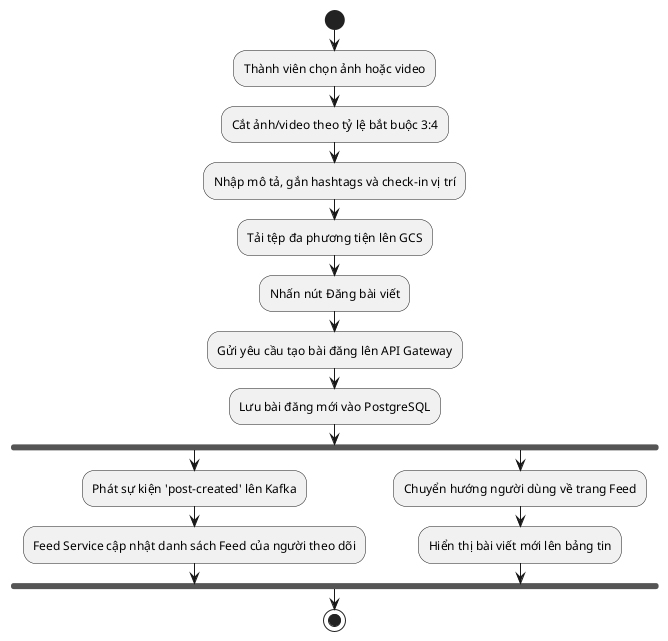

---

#### UC-07: Biên tập hình ảnh/video

- **Tác nhân chính (Actor):** Thành viên (User)
- **Mục tiêu:** Điều chỉnh hiệu ứng hình ảnh hoặc chọn khung hình hiển thị đại diện cho video.
- **Tiền điều kiện:** Thành viên đang thực hiện tạo bài đăng mới (UC-06).
- **Hậu điều kiện:** Bộ lọc (Filter) được áp lên ảnh hoặc ảnh bìa (thumbnail) video được trích xuất sẵn sàng để đăng tải.
- **Luồng sự kiện chính:**
  1. Trong giao diện tạo bài viết, hệ thống hiển thị bảng lọc màu hình ảnh thời gian thực.
  2. Thành viên chọn bộ lọc mong muốn; hoặc đối với video, thành viên kéo thanh trượt thời gian (Frame Picker) để chọn ra 1 khung hình làm ảnh đại diện hiển thị cho video.
  3. Hệ thống áp dụng hiệu ứng và lưu giữ tệp tin đã chỉnh sửa.

##### A. Biểu đồ trình tự (Sequence Diagram - UC-07)

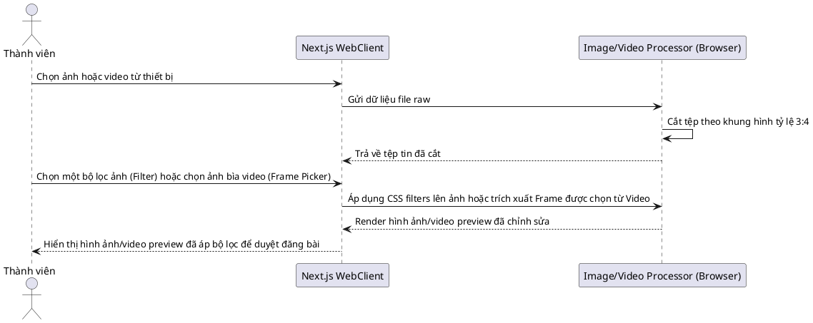

##### B. Biểu đồ hoạt động (Activity Diagram - UC-07)

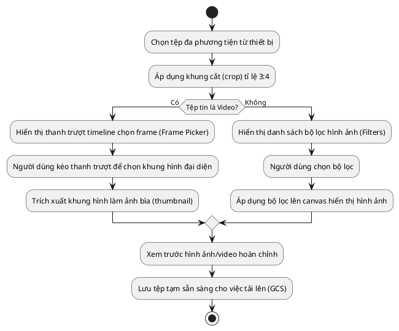

---

#### UC-08: Xem Bảng tin & Reels

- **Tác nhân chính (Actor):** Thành viên (User)
- **Mục tiêu:** Đọc các tin tức mới từ người theo dõi hoặc trải nghiệm các thước phim ngắn.
- **Tiền điều kiện:** Thành viên đã đăng nhập hệ thống.
- **Hậu điều kiện:** Dữ liệu bài viết, video hiển thị mượt mà trên giao diện người dùng.
- **Luồng sự kiện chính:**
  1. Thành viên truy cập vào Bảng tin (Feed) hoặc trang Reels.
  2. Next.js Client gửi truy vấn lấy thông tin Feed tới API Gateway, sau đó chuyển tới Feed Service.
  3. Feed Service lấy danh sách bài đăng từ Redis Cache (để đạt tốc độ tải cao) hoặc PostgreSQL.
  4. Hệ thống kết xuất giao diện dạng cuộn vô hạn (infinite scroll). Đối với video, Client phát qua luồng HLS (`.m3u8`) từ GCS.

##### A. Biểu đồ trình tự (Sequence Diagram - UC-08)

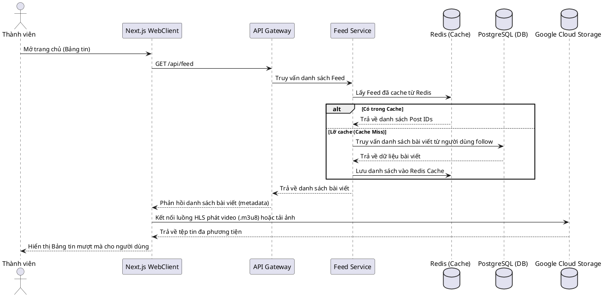

##### B. Biểu đồ hoạt động (Activity Diagram - UC-08)

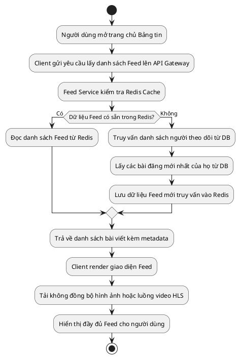

---

## III. Phân hệ 3: Tương tác & Báo cáo (Engagement & Moderation)

### 1. Sơ đồ Use Case phân hệ

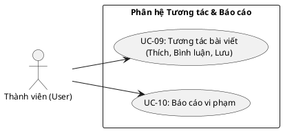

#### Mô tả tóm tắt các Use Case trong Phân hệ 3:

| Mã Use Case | Tên Use Case       | Tác nhân (Actor)  | Mô tả tóm tắt chức năng                                                           |
| :---------- | :----------------- | :---------------- | :-------------------------------------------------------------------------------- |
| **UC-09**   | Tương tác bài viết | Thành viên (User) | Thích (tim), bình luận, hoặc lưu trữ bài viết của người dùng khác.                |
| **UC-10**   | Báo cáo vi phạm    | Thành viên (User) | Gửi khiếu nại về bài viết/bình luận có nội dung không lành mạnh lên ban quản trị. |

### 2. Mô tả đặc tả và các biểu đồ chi tiết chức năng

#### UC-09: Tương tác bài viết (Thích, Bình luận, Lưu)

- **Tác nhân chính (Actor):** Thành viên (User)
- **Mục tiêu:** Bày tỏ thái độ hoặc để lại ý kiến phản hồi trên bài viết của người khác.
- **Tiền điều kiện:** Thành viên đã đăng nhập hệ thống, bài viết muốn tương tác đang tồn tại.
- **Hậu điều kiện:** Lượt tương tác được lưu lại và hiển thị số lượng tăng lên trên giao diện bài đăng.
- **Luồng sự kiện chính:**
  1. Thành viên cuộn bảng tin và dừng lại xem bài viết.
  2. Thành viên nhấn đúp vào ảnh hoặc nhấn biểu tượng tim để thích; nhập văn bản bình luận và gửi đi; hoặc nhấn biểu tượng Bookmark để lưu trữ vào bộ sưu tập cá nhân.
  3. Hệ thống tiếp nhận yêu cầu, cập nhật số liệu vào PostgreSQL (via Engagements Service).
  4. Hệ thống phát tin báo tới Kafka để kích hoạt dịch vụ thông báo thời gian thực.

##### A. Biểu đồ trình tự (Sequence Diagram - UC-09)

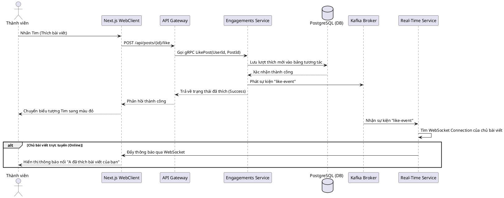

##### B. Biểu đồ hoạt động (Activity Diagram - UC-09)

```plantuml
@startuml Activity Interact
start
:Thành viên xem bài viết;
if (Thực hiện hành động?) then (Thích)
  :Nhấn Tim bài viết;
  :Gửi yêu cầu Thích lên API Gateway;
  :Thêm lượt thích vào PostgreSQL;
  :Phát sự kiện Kafka;
  :Thông báo real-time tới chủ bài viết;
else (Bình luận)
  :Nhập nội dung bình luận;
  :Gửi bình luận lên API Gateway;
  :Lưu bình luận vào PostgreSQL;
  :Phát sự kiện Kafka;
  :Thông báo real-time tới chủ bài viết;
else (Lưu)
  :Nhấn biểu tượng Lưu bài viết;
  :Gửi yêu cầu Lưu lên API Gateway;
  :Lưu bài viết vào bộ sưu tập cá nhân trong PostgreSQL;
endif
stop
@enduml
```

---

#### UC-10: Báo cáo vi phạm

- **Tác nhân chính (Actor):** Thành viên (User)
- **Mục tiêu:** Gửi khiếu nại về nội dung độc hại, vi phạm chính sách cộng đồng lên ban quản trị.
- **Tiền điều kiện:** Bài đăng hoặc bình luận vi phạm đang hiển thị trên giao diện.
- **Hậu điều kiện:** Đơn báo cáo được ghi nhận thành công và chuyển vào hàng đợi duyệt của Admin.
- **Luồng sự kiện chính:**
  1. Thành viên phát hiện bài đăng hoặc bình luận phản cảm.
  2. Thành viên nhấn nút "Báo cáo" cạnh nội dung đó.
  3. Hệ thống hiển thị hộp thoại chọn lý do (Spam, Bạo lực, Khiêu dâm, Quấy rối...).
  4. Thành viên chọn lý do và nhấn "Gửi báo cáo".
  5. Hệ thống lưu trữ khiếu nại vào cơ sở dữ liệu và phân luồng tới Dashboard xử lý của Admin.

##### A. Biểu đồ trình tự (Sequence Diagram - UC-10)

```plantuml
@startuml Sequence Report
actor "Thành viên" as User
participant "Next.js WebClient" as Client
participant "API Gateway" as Gateway
participant "Engagements Service" as EngService
database "PostgreSQL (DB)" as DB

User -> Client: Chọn báo cáo vi phạm bài viết/bình luận
Client -> User: Hiển thị danh mục lý do vi phạm
User -> Client: Chọn lý do & nhấn gửi
Client -> Gateway: POST /api/moderation/report
Gateway -> EngService: Gọi gRPC ReportContent(ReporterId, ContentId, Type, Reason)
EngService -> DB: Lưu bản ghi báo cáo mới vào PostgreSQL
DB --> EngService: Xác nhận thành công
EngService --> Gateway: Trả về trạng thái thành công
Gateway --> Client: Phản hồi thành công
Client --> User: Hiển thị thông báo cảm ơn đã báo cáo
@enduml
```

##### B. Biểu đồ hoạt động (Activity Diagram - UC-10)

```plantuml
@startuml Activity Report
start
:Người dùng chọn báo cáo nội dung;
:Chọn lý do vi phạm (Spam, Bạo lực, Khiêu dâm...);
:Gửi yêu cầu báo cáo lên API Gateway;
:Lưu thông tin báo cáo (ContentId, ReporterId, Lý do) vào PostgreSQL;
if (Lưu thành công?) then (Có)
  :Gửi thông báo cám ơn đến người báo cáo;
  :Chuyển bản ghi vào hàng đợi kiểm duyệt của Admin;
  stop
else (Không)
  :Thông báo lỗi hệ thống thử lại sau;
  stop
endif
@enduml
```

---

## IV. Phân hệ 4: Tin nhắn & Thông báo (Messaging & Notifications)

### 1. Sơ đồ Use Case phân hệ

```plantuml
@startuml Usecase Messaging
left to right direction
skinparam BackgroundColor #FFFFFF
skinparam Shadowing false
skinparam DefaultFontName "Segoe UI"
skinparam DefaultFontSize 12

actor "Thành viên (User)" as User

rectangle "Phân hệ Tin nhắn & Thông báo" {
  usecase "UC-11: Nhắn tin trực tiếp" as UC11
  usecase "UC-12: Nhận thông báo" as UC12
}

User --> UC11
User --> UC12
@enduml
```

#### Mô tả tóm tắt các Use Case trong Phân hệ 4:

| Mã Use Case | Tên Use Case       | Tác nhân (Actor)  | Mô tả tóm tắt chức năng                                                       |
| :---------- | :----------------- | :---------------- | :---------------------------------------------------------------------------- |
| **UC-11**   | Nhắn tin trực tiếp | Thành viên (User) | Trò chuyện và gửi tin nhắn thời gian thực trực tiếp tới bạn bè qua WebSocket. |
| **UC-12**   | Nhận thông báo     | Thành viên (User) | Nhận thông báo thời gian thực về hoạt động thích, bình luận, theo dõi mới.    |

### 2. Mô tả đặc tả và các biểu đồ chi tiết chức năng

#### UC-11: Nhắn tin trực tiếp (Chat)

- **Tác nhân chính (Actor):** Thành viên (User)
- **Mục tiêu:** Trò chuyện trực tuyến riêng tư, gửi tin nhắn văn bản tức thời tới người dùng khác.
- **Tiền điều kiện:** Cả hai tài khoản người dùng đều đang hoạt động tốt.
- **Hậu điều kiện:** Tin nhắn được chuyển giao thời gian thực và được lưu trữ lại lịch sử hội thoại.
- **Luồng sự kiện chính:**
  1. Thành viên mở mục nhắn tin (Direct Message) và chọn người dùng muốn bắt đầu cuộc trò chuyện.
  2. Thành viên nhập nội dung tin nhắn vào ô chat và nhấn "Gửi".
  3. Real-Time Service nhận tin nhắn qua giao thức WebSocket và định tuyến chuyển thẳng tới người nhận (nếu họ trực tuyến).
  4. Hệ thống lưu trữ tin nhắn vào PostgreSQL.

##### A. Biểu đồ trình tự (Sequence Diagram - UC-11)

```plantuml
@startuml Sequence Chat
actor "Thành viên A" as UserA
participant "Next.js WebClient A" as ClientA
participant "Real-Time Service (WS)" as RTService
database "PostgreSQL (DB)" as DB
database "Redis (Pub/Sub)" as Redis
participant "Next.js WebClient B" as ClientB
actor "Thành viên B" as UserB

UserA -> ClientA: Nhập nội dung tin nhắn & nhấn Gửi
ClientA -> RTService: Gửi tin nhắn qua WebSocket (event: "send-message")
RTService -> DB: Lưu tin nhắn vào PostgreSQL (lịch sử chat)
DB --> RTService: Xác nhận lưu thành công
RTService -> Redis: Publish tin nhắn lên kênh Pub/Sub
Redis --> RTService: Nhận tin nhắn từ kênh Pub/Sub
RTService -> RTService: Xác định Connection của Thành viên B
alt Thành viên B đang Online
  RTService -> ClientB: Đẩy tin nhắn qua WebSocket (event: "receive-message")
  ClientB --> UserB: Hiển thị tin nhắn mới trên ô chat của B
else Thành viên B Offline
  RTService -> RTService: Lưu trạng thái chưa đọc (Unread)
end
RTService --> ClientA: Trả về trạng thái tin nhắn đã gửi (Sent)
ClientA --> UserA: Hiển thị tin nhắn đã gửi thành công
@enduml
```

##### B. Biểu đồ hoạt động (Activity Diagram - UC-11)

```plantuml
@startuml Activity Chat
start
:Thành viên A nhập nội dung tin nhắn và bấm Gửi;
:Client A chuyển tin nhắn lên Real-Time Service qua WebSocket;
:Real-Time Service tiếp nhận tin nhắn;
:Lưu tin nhắn vào PostgreSQL;
if (Thành viên B đang trực tuyến?) then (Đúng)
  :Gửi trực tiếp tin nhắn tới Client B qua WebSocket;
  :Client B hiển thị tin nhắn mới trên màn hình chat của B;
else (Sai)
  :Lưu trạng thái tin nhắn "Chưa đọc" vào PostgreSQL;
  :Tạo thông báo tin nhắn mới ngoại tuyến;
endif
:Client A nhận xác nhận từ server;
:Hiển thị trạng thái tin nhắn đã được gửi;
stop
@enduml
```

---

#### UC-12: Nhận thông báo

- **Tác nhân chính (Actor):** Thành viên (User)
- **Mục tiêu:** Giúp người dùng biết được các cập nhật hoạt động liên quan đến tài khoản của mình.
- **Tiền điều kiện:** Thành viên đang mở ứng dụng.
- **Hậu điều kiện:** Giao diện người dùng cập nhật chấm đỏ thông báo và hiển thị danh sách hoạt động mới.
- **Luồng sự kiện chính:**
  1. Khi xuất hiện các hành vi tương tác mới từ người dùng khác nhắm vào tài khoản thành viên.
  2. Microservice liên quan gửi một message sự kiện qua Kafka Broker.
  3. Real-Time Service đón nhận sự kiện này, lập tức đẩy dữ liệu thông báo qua kết nối WebSocket đang mở tới client của thành viên.
  4. Trình duyệt người dùng nhận thông tin và hiển thị pop-up thông báo trực quan.

##### A. Biểu đồ trình tự (Sequence Diagram - UC-12)

```plantuml
@startuml Sequence Notify
actor "Thành viên A" as UserA
participant "Next.js WebClient A" as ClientA
participant "Engagements Service" as EngService
participant "Kafka Broker" as Kafka
participant "Real-Time Service" as RTService
participant "Next.js WebClient B" as ClientB
actor "Thành viên B" as UserB

UserA -> ClientA: Thích/Bình luận bài viết của B
ClientA -> EngService: Gửi yêu cầu tương tác
EngService -> Kafka: Phát sự kiện tương tác "engagement-event"
Kafka -> RTService: Tiêu thụ sự kiện "engagement-event"
RTService -> RTService: Tạo dữ liệu thông báo mới và lưu DB
RTService -> RTService: Tìm kết nối WebSocket của B (UserB)
alt Thành viên B đang online
  RTService -> ClientB: Đẩy thông báo qua kết nối WebSocket (event: "notification")
  ClientB --> UserB: Hiển thị chấm đỏ & thông báo nổi trên app
else Thành viên B offline
  RTService -> RTService: Đánh dấu thông báo chưa đọc trong DB
end
@enduml
```

##### B. Biểu đồ hoạt động (Activity Diagram - UC-12)

```plantuml
@startuml Activity Notify
start
:Hệ thống phát sinh sự kiện tương tác (Like, Comment, Follow);
:Ghi nhận thông báo mới vào PostgreSQL;
:Real-Time Service kiểm tra kết nối WebSocket của người nhận;
if (Người nhận đang trực tuyến?) then (Đúng)
  :Gửi gói tin thông báo qua WebSocket;
  :Client người nhận hiển thị thông báo thời gian thực;
else (Sai)
  :Lưu trạng thái thông báo là "Chưa đọc";
  :Đợi người dùng đăng nhập lại để hiển thị trong mục Activity;
endif
stop
@enduml
```

---

## V. Phân hệ 5: Bảng điều khiển Quản trị (Admin Dashboard)

### 1. Sơ đồ Use Case phân hệ

```plantuml
@startuml Usecase Admin
left to right direction
skinparam BackgroundColor #FFFFFF
skinparam Shadowing false
skinparam DefaultFontName "Segoe UI"
skinparam DefaultFontSize 12

actor "Quản trị viên (Admin)" as Admin

rectangle "Phân hệ Dashboard Quản trị" {
  usecase "UC-13: Quản lý báo cáo vi phạm" as UC13
  usecase "UC-14: Quản lý Thư viện âm thanh" as UC14
  usecase "UC-15: Quản lý Hashtags" as UC15
  usecase "UC-16: Xem báo cáo thống kê" as UC16
  usecase "UC-17: Cấu hình hệ thống" as UC17
}

Admin --> UC13
Admin --> UC14
Admin --> UC15
Admin --> UC16
Admin --> UC17
@enduml
```

#### Mô tả tóm tắt các Use Case trong Phân hệ 5:

| Mã Use Case | Tên Use Case              | Tác nhân (Actor)      | Mô tả tóm tắt chức năng                                                         |
| :---------- | :------------------------ | :-------------------- | :------------------------------------------------------------------------------ |
| **UC-13**   | Quản lý báo cáo vi phạm   | QTV / Kiểm duyệt viên | Xem danh sách báo cáo vi phạm và thực hiện ẩn/xóa nội dung hoặc khóa tài khoản. |
| **UC-14**   | Quản lý Thư viện âm thanh | QTV / Kiểm duyệt viên | Thêm mới hoặc xóa bỏ các tệp nhạc dùng làm nhạc nền cho Reels.                  |
| **UC-15**   | Quản lý Hashtags          | QTV / Kiểm duyệt viên | Giám sát các hashtags thịnh hành và ẩn/xóa các hashtag vi phạm chính sách.      |
| **UC-16**   | Xem báo cáo thống kê      | QTV / Kiểm duyệt viên | Theo dõi các chỉ số tăng trưởng người dùng, tương tác, bài viết qua biểu đồ.    |
| **UC-17**   | Cấu hình hệ thống         | QTV cấp cao           | Cấu hình các thiết lập vận hành toàn hệ thống (kích thước file, phân quyền...). |

### 2. Mô tả đặc tả và các biểu đồ chi tiết chức năng

#### UC-13: Quản lý báo cáo vi phạm

- **Tác nhân chính (Actor):** Quản trị viên / Kiểm duyệt viên (Admin / Moderator)
- **Mục tiêu:** Xem xét các khiếu nại nội dung từ cộng đồng và ra quyết định xử lý kỷ luật.
- **Tiền điều kiện:** Tài khoản Admin đã đăng nhập hệ thống và có quyền hạn kiểm duyệt.
- **Hậu điều kiện:** Bài viết/bình luận vi phạm bị ẩn/xóa, hoặc tài khoản người dùng vi phạm bị khóa tạm thời/vĩnh viễn.
- **Luồng sự kiện chính:**
  1. Admin mở mục "Moderation" trên Dashboard để xem danh sách báo cáo vi phạm đang chờ xử lý.
  2. Hệ thống hiển thị chi tiết nội dung bị báo cáo, số lượng người báo cáo và lý do vi phạm.
  3. Admin tiến hành kiểm duyệt nội dung đó.
  4. Admin chọn nút hành động: "Xóa bài viết", "Khóa tài khoản" hoặc "Bỏ qua báo cáo".
  5. Hệ thống ghi nhận quyết định, cập nhật trạng thái trong PostgreSQL, ẩn nội dung khỏi giao diện Client và gửi thông báo cảnh cáo tới người vi phạm.

##### A. Biểu đồ trình tự (Sequence Diagram - UC-13)

```plantuml
@startuml Sequence Manage Reports
actor "Quản trị viên" as Admin
participant "Dashboard WebClient" as Client
participant "API Gateway" as Gateway
participant "Engagements Service" as EngService
database "PostgreSQL (DB)" as DB

Admin -> Client: Mở mục Moderation (Kiểm duyệt)
Client -> Gateway: GET /api/moderation/reports (Kèm Token)
Gateway -> Gateway: Kiểm tra token với PermGuard
Gateway -> EngService: Gọi gRPC GetReportsList()
EngService -> DB: Lấy danh sách bài viết bị báo cáo vi phạm
DB --> EngService: Trả về danh sách báo cáo
EngService --> Gateway: Trả về danh sách báo cáo
Gateway --> Client: Trả về dữ liệu báo cáo vi phạm
Client --> Admin: Hiển thị danh sách báo cáo trên Dashboard

Admin -> Client: Chọn Xóa bài viết vi phạm
Client -> Gateway: DELETE /api/posts/{postId} (Moderator action)
Gateway -> Gateway: Xác thực quyền qua PermGuard
Gateway -> EngService: Gọi gRPC DeletePostByModerator(PostId)
EngService -> DB: Xóa hoặc ẩn bài đăng trong DB
DB --> EngService: Xác nhận thành công
EngService --> Gateway: Trả về kết quả thành công
Gateway --> Client: Phản hồi hành động thành công
Client --> Admin: Cập nhật giao diện ẩn bài viết đó
@enduml
```

##### B. Biểu đồ hoạt động (Activity Diagram - UC-13)

```plantuml
@startuml Activity Manage Reports
start
:Admin truy cập trang Moderation trên Dashboard;
:Hệ thống gọi API Gateway để xác thực quyền quản trị;
if (Admin có quyền hạn hợp lệ?) then (Đúng)
  :Lấy danh sách các bài viết bị báo cáo từ PostgreSQL;
  :Hiển thị danh sách báo cáo lên Dashboard;
  :Admin duyệt từng nội dung báo cáo;
  if (Nội dung có thực sự vi phạm?) then (Đúng)
    :Admin chọn nút Xóa nội dung;
    :Cập nhật trạng thái ẩn/xóa bài đăng trong DB;
    :Gửi thông báo vi phạm đến người dùng;
  else (Không)
    :Admin chọn Bỏ qua báo cáo;
    :Đánh dấu báo cáo đã xử lý (bỏ qua) trong DB;
  endif
  :Cập nhật lại danh sách báo cáo trên giao diện;
  stop
else (Sai)
  :Chuyển hướng về trang lỗi 403 Forbidden;
  stop
endif
@enduml
```

---

#### UC-14: Quản lý Thư viện âm thanh

- **Tác nhân chính (Actor):** Quản trị viên / Kiểm duyệt viên (Admin / Moderator)
- **Mục tiêu:** Cập nhật danh sách các tệp âm thanh dùng làm nhạc nền có sẵn trên ứng dụng.
- **Tiền điều kiện:** Admin đã đăng nhập thành công vào Dashboard quản trị.
- **Hậu điều kiện:** Thư viện nhạc nền của Gigglegram được thêm/bớt/sửa các bài hát.
- **Luồng sự kiện chính:**
  1. Admin truy cập vào mục "Audio Management" trên Dashboard.
  2. Admin bấm chọn "Tải lên tệp âm thanh mới".
  3. Admin chọn tệp tin nhạc (.mp3) từ máy tính, nhập tên bài hát, nghệ sĩ biểu diễn và ảnh bìa.
  4. Hệ thống tải tệp âm thanh lên GCS, đồng thời lưu thông tin chi tiết vào cơ sở dữ liệu PostgreSQL.

##### A. Biểu đồ trình tự (Sequence Diagram - UC-14)

```plantuml
@startuml Sequence Manage Audio
actor "Quản trị viên" as Admin
participant "Dashboard WebClient" as Client
participant "API Gateway" as Gateway
participant "System Settings Service" as SysService
database "Google Cloud Storage" as GCS
database "PostgreSQL (DB)" as DB

Admin -> Client: Chọn tải lên tệp âm thanh mới (.mp3)
Client -> GCS: Tải tệp âm thanh lên GCS
GCS --> Client: Trả về URL tệp âm thanh
Client -> Gateway: POST /api/moderation/audio/create (Title, Artist, Url)
Gateway -> Gateway: Kiểm tra quyền quản trị với PermGuard
Gateway -> SysService: Gọi gRPC CreateAudio(Title, Artist, Url)
SysService -> DB: Lưu bản ghi âm thanh mới vào PostgreSQL
DB --> SysService: Xác nhận thành công
SysService --> Gateway: Trả về Audio ID
Gateway --> Client: Phản hồi thành công
Client --> Admin: Hiển thị tệp âm thanh mới trong thư viện
@enduml
```

##### B. Biểu đồ hoạt động (Activity Diagram - UC-14)

```plantuml
@startuml Activity Manage Audio
start
:Admin truy cập Quản lý âm thanh trên Dashboard;
:Nhấp thêm âm thanh mới;
:Nhập tiêu đề, nghệ sĩ và tải lên tệp .mp3 lên GCS;
:Gửi thông tin bài hát và URL âm thanh lên API Gateway;
:Xác thực quyền Admin (PermGuard);
if (Hợp lệ?) then (Có)
  :Lưu thông tin âm thanh mới vào PostgreSQL;
  :Hiển thị âm thanh mới trong danh sách quản lý;
  stop
else (Không)
  :Từ chối yêu cầu (403 Forbidden);
  stop
endif
@enduml
```

---

#### UC-15: Quản lý Hashtags

- **Tác nhân chính (Actor):** Quản trị viên / Kiểm duyệt viên (Admin / Moderator)
- **Mục tiêu:** Quản lý và làm sạch từ khóa xu hướng trong cộng đồng.
- **Tiền điều kiện:** Admin đã đăng nhập thành công vào Dashboard quản trị.
- **Hậu điều kiện:** Các thẻ hashtag độc hại bị xóa hoặc ẩn khỏi mục tìm kiếm.
- **Luồng sự kiện chính:**
  1. Admin truy cập mục "Hashtags Management" trên Dashboard.
  2. Hệ thống hiển thị danh sách các hashtags đang phổ biến và tỷ lệ xuất hiện của chúng trong các bài đăng.
  3. Admin chọn ẩn hoặc xóa các hashtags vi phạm chính sách nội dung.
  4. Hệ thống cập nhật cơ sở dữ liệu, ngăn chặn người dùng gắn hashtags này vào các bài viết mới.

##### A. Biểu đồ trình tự (Sequence Diagram - UC-15)

```plantuml
@startuml Sequence Manage Hashtags
actor "Quản trị viên" as Admin
participant "Dashboard WebClient" as Client
participant "API Gateway" as Gateway
participant "Posts Service" as PostService
database "PostgreSQL (DB)" as DB

Admin -> Client: Chọn ẩn/xóa Hashtag vi phạm
Client -> Gateway: DELETE /api/moderation/hashtags/{tagId}
Gateway -> Gateway: Xác thực quyền với PermGuard
Gateway -> PostService: Gọi gRPC DeleteHashtag(TagId)
PostService -> DB: Cập nhật trạng thái Hashtag thành ẩn/xóa
DB --> PostService: Xác nhận thành công
PostService --> Gateway: Phản hồi thành công
Gateway --> Client: Phản hồi thành công
Client --> Admin: Cập nhật danh sách ẩn Hashtag trên Dashboard
@enduml
```

##### B. Biểu đồ hoạt động (Activity Diagram - UC-15)

```plantuml
@startuml Activity Manage Hashtags
start
:Admin truy cập quản lý Hashtags trên Dashboard;
:Hệ thống lấy danh sách hashtags phổ biến hiển thị;
:Admin chọn hashtag có nội dung độc hại;
:Chọn nút ẩn/xóa hashtag;
:Gửi yêu cầu xóa lên API Gateway;
:Xác thực quyền hạn Admin;
if (Quyền hợp lệ?) then (Có)
  :Cập nhật trạng thái ẩn hashtag trong PostgreSQL;
  :Hệ thống ngăn chặn hiển thị hashtag này trên mục tìm kiếm;
  :Thông báo thực hiện thành công;
  stop
else (Không)
  :Từ chối yêu cầu (403 Forbidden);
  stop
endif
@enduml
```

---

#### UC-16: Xem báo cáo thống kê

- **Tác nhân chính (Actor):** Quản trị viên / Kiểm duyệt viên (Admin / Moderator)
- **Mục tiêu:** Đánh giá tổng quan hoạt động và dữ liệu tăng trưởng của Gigglegram.
- **Tiền điều kiện:** Admin đã đăng nhập thành công vào Dashboard quản trị.
- **Hậu điều kiện:** Báo cáo dữ liệu và biểu đồ trực quan được kết xuất ra giao diện màn hình.
- **Luồng sự kiện chính:**
  1. Admin mở trang chủ Dashboard hoặc click mục "Reports".
  2. Hệ thống thực hiện các phép truy vấn gộp (Aggregations) dữ liệu hoạt động hệ thống từ PostgreSQL (qua Drizzle) và Redis.
  3. Hệ thống hiển thị biểu đồ đường biểu diễn sự tăng trưởng người dùng mới, biểu đồ cột biểu diễn lượng tương tác bài viết theo ngày/tháng/năm.

##### A. Biểu đồ trình tự (Sequence Diagram - UC-16)

```plantuml
@startuml Sequence View Stats
actor "Quản trị viên" as Admin
participant "Dashboard WebClient" as Client
participant "API Gateway" as Gateway
participant "System Settings Service" as SysService
database "Redis (Cache)" as Redis
database "PostgreSQL (DB)" as DB

Admin -> Client: Mở tab Báo cáo thống kê
Client -> Gateway: GET /api/moderation/statistics
Gateway -> Gateway: Xác thực quyền với PermGuard
Gateway -> SysService: Gọi gRPC GetSystemStats()
SysService -> Redis: Lấy số liệu thống kê cache (lượt truy cập, hoạt động)
alt Có sẵn trong Cache
  Redis --> SysService: Trả về số liệu cache
else Cache Miss
  SysService -> DB: Thực hiện câu lệnh gộp COUNT, SUM trên các bảng (Users, Posts, Likes)
  DB --> SysService: Trả về kết quả truy vấn
  SysService -> Redis: Lưu số liệu mới vào Redis Cache (1 tiếng)
end
SysService --> Gateway: Trả về đối tượng thống kê tổng hợp
Gateway --> Client: Phản hồi dữ liệu thống kê
Client -> Client: Vẽ biểu đồ trực quan (Recharts/Chart.js)
Client --> Admin: Hiển thị các biểu đồ tăng trưởng hệ thống
@uml
```

##### B. Biểu đồ hoạt động (Activity Diagram - UC-16)

```plantuml
@startuml Activity View Stats
start
:Admin mở trang Báo cáo & Thống kê;
:Gửi yêu cầu truy vấn dữ liệu lên API Gateway;
:Xác thực quyền Admin;
if (Hợp lệ?) then (Có)
  :Kiểm tra Redis Cache;
  if (Có số liệu lưu tạm?) then (Có)
    :Lấy số liệu từ Redis Cache;
  else (Không)
    :Thực hiện truy vấn gộp (Aggregations) trên PostgreSQL;
    :Lưu kết quả tổng hợp vào Redis Cache;
  endif
  :Trả về dữ liệu báo cáo dạng JSON;
  :Client dựng các biểu đồ tăng trưởng trực quan;
  :Hiển thị biểu đồ cho Admin;
  stop
else (Không)
  :Từ chối yêu cầu (403 Forbidden);
  stop
endif
@enduml
```

---

#### UC-17: Cấu hình hệ thống

- **Tác nhân chính (Actor):** Quản trị viên cấp cao (Admin)
- **Mục tiêu:** Thiết lập các tham số vận hành chung cho mạng xã hội.
- **Tiền điều kiện:** Đăng nhập dưới tài khoản Admin có quyền lực cao nhất (Root Admin).
- **Hậu điều kiện:** Thay đổi cấu hình mới được lưu và đồng bộ xuống toàn bộ hệ thống.
- **Luồng sự kiện chính:**
  1. Admin truy cập vào mục "Settings" của Dashboard.
  2. Admin chỉnh sửa các cấu hình hệ thống: như giới hạn dung lượng tải ảnh/video, cấu hình thư mục lưu trữ, hoặc quản trị tài khoản phân quyền Moderator.
  3. Admin nhấn chọn "Cập nhật cấu hình".
  4. Hệ thống lưu cấu hình mới và truyền tin đồng bộ tới các microservices liên quan thông qua cổng giao tiếp gRPC.

##### A. Biểu đồ trình tự (Sequence Diagram - UC-17)

```plantuml
@startuml Sequence System Settings
actor "Quản trị viên" as Admin
participant "Dashboard WebClient" as Client
participant "API Gateway" as Gateway
participant "System Settings Service" as SysService
database "PostgreSQL (DB)" as DB
database "Redis (Cache)" as Redis

Admin -> Client: Thay đổi thông số cấu hình hệ thống & nhấn Lưu
Client -> Gateway: POST /api/moderation/settings/update
Gateway -> Gateway: Xác thực quyền lực Root Admin với PermGuard
Gateway -> SysService: Gọi gRPC UpdateSystemSettings(ConfigData)
SysService -> DB: Cập nhật thông số cấu hình mới
DB --> SysService: Xác nhận thành công
SysService -> Redis: Xóa hoặc cập nhật cấu hình cũ trong cache
Redis --> SysService: Xác nhận thành công
SysService --> Gateway: Phản hồi thành công
Gateway --> Client: Phản hồi thành công
Client --> Admin: Hiển thị thông báo cấu hình hệ thống cập nhật thành công
@enduml
```

##### B. Biểu đồ hoạt động (Activity Diagram - UC-17)

```plantuml
@startuml Activity System Settings
start
:Admin mở mục Cài đặt hệ thống trên Dashboard;
:Thay đổi các cài đặt vận hành (kích thước file, phân quyền...);
:Nhấn Lưu cấu hình;
:Gửi yêu cầu cập nhật lên API Gateway;
:Kiểm tra quyền hạn Root Admin;
if (Quyền hợp lệ?) then (Có)
  :Cập nhật các thông số cài đặt vào PostgreSQL;
  :Cập nhật hoặc đồng bộ lại cache cấu hình trên Redis;
  :Áp dụng cấu hình mới cho toàn bộ các microservices;
  :Thông báo cấu hình đã được áp dụng;
  stop
else (Không)
  :Hiển thị lỗi phân quyền (403 Forbidden);
  stop
endif
@enduml
```
